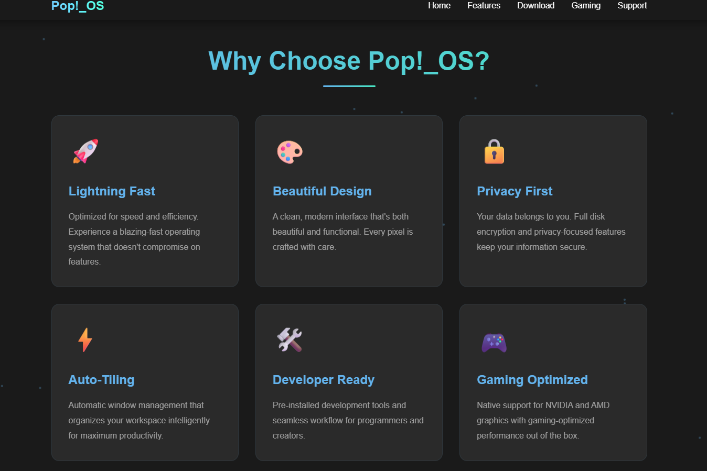

# Pop!_OS Website Clone 🚀

A modern, responsive **frontend clone** of the [Pop!_OS official website](https://pop.system76.com/) built using **HTML, CSS, and JavaScript**.  
This project was created as part of a recruitment task to demonstrate frontend development skills.

---

## ✨ Features

- **Responsive Design** – Works smoothly across desktop, tablet, and mobile  
- **Smooth Animations** – Scroll, hover, and button effects for a dynamic feel  
- **Auto-Tiling Section** – Highlighting Pop!_OS’s signature workspace management  
- **Gaming Focus** – Dedicated section for gaming support  
- **Modern UI/UX** – Glassmorphism, hover effects, and minimalistic layout  

---

## 🛠️ Technologies Used

- **HTML5** – Semantic markup  
- **CSS3** – Flexbox, Grid, Animations  
- **JavaScript (Vanilla)** – Interactivity & dynamic elements  
- **Git & GitHub** – Version control and repository hosting  

---

## 📸 Screenshots

| Homepage | Features Section | Download Section |
| --- | --- | --- |
|  |  |  |

---

## 🚀 Live Demo (Optional)

You can deploy the site using **Vercel** or **Netlify**.  
Example: [Live Demo Link](https://popos-clone-jet.vercel.app/)

---

## 🎨 Color Palette

- **Primary:** `#63B3ED`  
- **Secondary:** `#48E5C2`  
- **Accent:** `#FAA41A`  
- **Dark Background:** `#1A1A1A`

---

## 📄 License

This project is **for educational purposes only**.  
Pop!_OS is a trademark of System76.

---

## 👩‍💻 Author

**Anushka**  
- GitHub: [@anushkaagr-2006](https://github.com/anushkaagr-2006)

---

## 🙏 Acknowledgments

- Inspired by the official Pop!_OS website  
- Thanks to System76 for creating an amazing Linux distribution  

